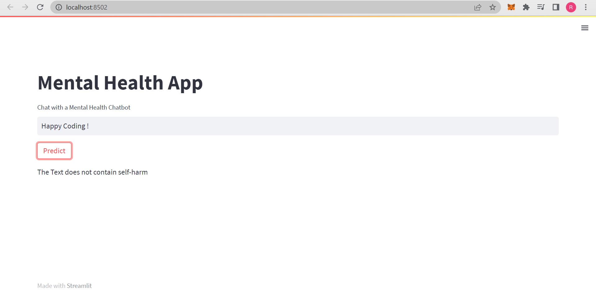

# Mental-Health-Prediction-App



## Table of Contents
* [About](#about)
* [Installation](#installation)
* [Usage](#usage)
* [Contributing](#contributing)
* [License](#license)


## About
Using the data from the [Suicide and Depression Detection](https://www.kaggle.com/datasets/nikhileswarkomati/suicide-watch), we created a web app that predicts whether or not a person would seek professional help for mental health issues. The app is built using the [Streamlit](https://streamlit.io/) framework.

## Installation

### prerequisites
* Python 3.8+

### Clone

Clone this repo to your local machine using
```
git clone https://github.com/RutujaPotdar/Mental-Health-App.git
```

### Setup
* Create a virtual environment
```bash
cd Mental-Health-App
pip install pipenv
pipenv shell
```
* Install the requirements
```bash
pip install -r requirements.txt
```
* Install nltk.stopwords
```python
python 
import nltk
nltk.download('stopword')
```
## Usage
Make sure you are in Mental-Health-App Folder and run following
```
streamlit run app.py
```

## License
Mental-Health-App is licensed under the [Apache-2.0 license](LICENSE).

Made with :heart: by [Rutuja](https://github.com/RutujaPotdar/)